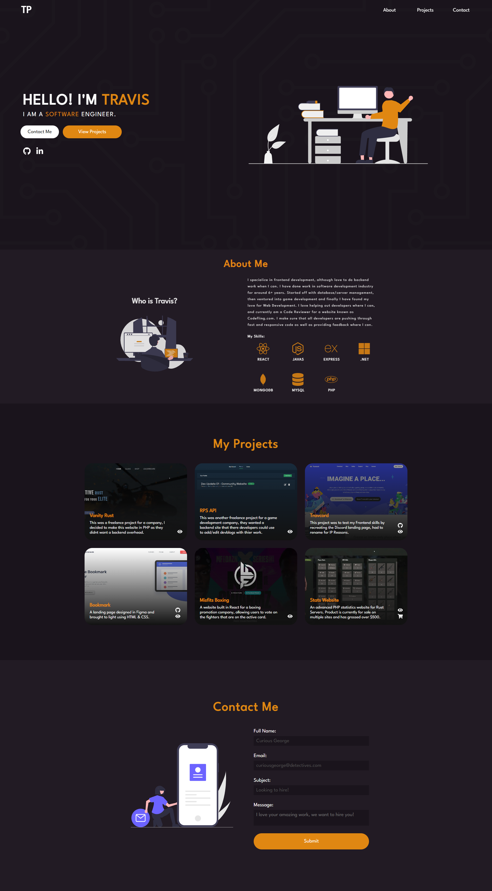

# My Portfolio Website

This is a project that I created to display my skills and my projects for recruiters. This project was created to react, as I wanted to have ease of access of a component layout.

## Table of contents

- [Overview](#overview)
  - [The Challenge](#the-challenge)
  - [Screenshot](#screenshot)
  - [Links](#links)
- [My process](#my-process)
  - [Built with](#built-with)
  - [What I learned](#what-i-learned)

## Overview

### The Challenge

Make a portfolio website:

- Come up with a simple but sleek design
- Make page fully responsive for all devices
- Add scroll animations for flashiness
- Make a contact page, not using the typical mailto:

### Screenshot

### Links

- Live Site URL: [Portfolio Page](https://travisp.dev/)

## My process

I started off by coming up with a design, I researched on YouTube to see how others portfolios looked. I then watched a ton of videos on portfolio reviews from people in the industry to get feedback on the do's and dont's for a portfolio page. One I established my research, I then began development starting desktop first from top to bottom and then working on responsiveness after. Once done with that, was time to implement gasp to add scroll animations which then completed my website.

### Built with

- HTML
- CSS
- [React](https://reactjs.org/) - Frontend JS Libary
- Grid for Projects Section

### What I learned

With this project, I learned how to implement scroll animations using the GASP library. I wanted my page to be flashy but also didn't want to do too much, so I kept the animations very simple all though did create them myself rather than using the presets. I also learned how to be creative and come up unique designs and follow proper contrast rules.
